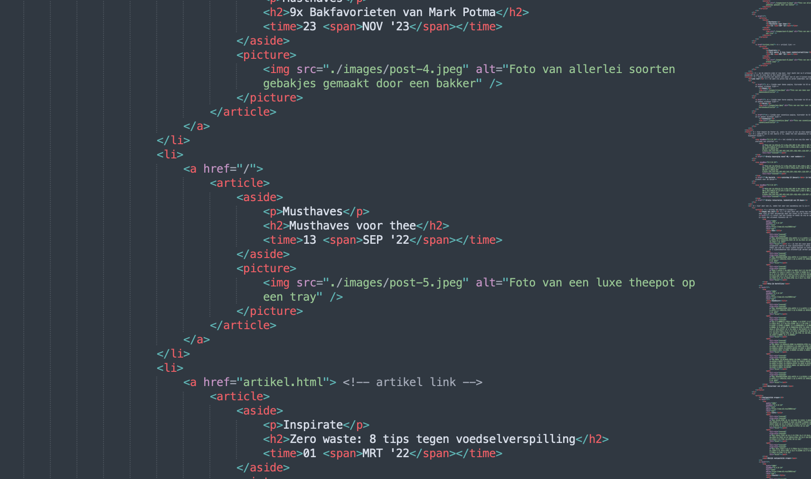

# Procesverslag
Markdown is een simpele manier om HTML te schrijven.  
Markdown cheat cheet: [Hulp bij het schrijven van Markdown](https://github.com/adam-p/markdown-here/wiki/Markdown-Cheatsheet).

Nb. De standaardstructuur en de spartaanse opmaak van de README.md zijn helemaal prima. Het gaat om de inhoud van je procesverslag. Besteedt de tijd voor pracht en praal aan je website.

Nb. Door *open* toe te voegen aan een *details* element kun je deze standaard open zetten. Fijn om dat steeds voor de relevante stuk(ken) te doen.

## Jij

uitwerken voor kick-off werkgroep

### Auteur:
Luca Kleene

#### Je startniveau:
Blauw

#### Je focus:
Responsive plane

## Je website

uitwerken voor kick-off werkgroep

### Je opdracht:
https://www.debijenkorf.nl/inspiratie/wonen/eten-drinken
https://www.debijenkorf.nl/inspiratie/wonen/tips-om-voedselverspilling-te-voorkomen

#### Screenshot(s) van de eerste pagina (small screen):
Homepage  

#### Screenshot(s) van de tweede pagina (small screen):
Inspiratie wonen  

## Breakdownschets (week 1)

Hieronder de eerste breakdownschets nog zonder verwerkte feedback.

### de hele pagina:

### dynamisch deel (bijv menu):

## Voortgang 1 (week 2)

Ik ben nog niet begonnen met t daadwerkelijk coderen. Wel heb ik de breakdownschet van beide pagina's van de website afgemaakt en daar wil ik nu feedback op krijgen. Na de feedback wil ik de opzet van html gaan invullen

### Stand van zaken
Het maken van de breakdownschets ging wel goed, ik heb een paar punten waar ik twijfel over het juiste element waarop ik nu graag feedback wil krijgen.

### Agenda voor meeting
Ik heb de feedbackronde alleen gedaan, omdat ik tijdens de reguliere tijd niet kon. Ik heb in mijn breakdownschets vraagtekens neergezet waar ik feedback op wil

### Verslag van meeting
hier na afloop snel de uitkomsten van de meeting vastleggen

- over een paar elementen duidelijkheid gekregen en aangepast
- nu beginnen met het invullen van de echte html
- verder zag de breakdownschets er goed uit

## Voortgang 2 (week 3)

uitwerken voor 2e voortgang

### Stand van zaken
Ik heb echt heel veel moeit met het starten van mijn code. Omdat ik het druk heb maar daarnaast nog meer omdat ik er hoofdpijn van krijg en een enorme stressaanval. Ik ben wel begonnen met de eerste pagina om daar de ruwe html van in te zetten

### Verslag van meeting

Er is naar gekeken, wat ik tot toe had. Dit ging voorlopig nog alleen om een hele globale opzet van de elementen, zonder nog afbeeldingen etc te hebben toegevoegd.
Voor mezelf wel echt de deadline gesteld bij de volgende voortgang minstens 1 pagina af te hebben zodat ik feedback erop kan krijgen. De eerste pagina is het moeilijkste, bij de tweede kan ik de header en footer over nemen en de main vind ik er persoonlijk niet moeilijk uitzien en dat moet me wel lukken. Dus daarom wil ik graag iig de eerste pagina af hebben zodat ik gerichte vragen kan stellen en hopelijk met iemand met een screenreader eroverheen kan gaan.

## Toegankelijkheidstest huidige pagina (week 2)

### Bevindingen
Lijst met je bevindingen die in de test naar voren kwamen:

#### Titel eerste bevinding
Er wordt niet aan de gebruiker duidelijk gemaakt op welke pagina hij zich momenteel van de 4 li bevindt

een inclusively hidden elementen waarop te horen is dat de gebruiker zich op die pagina bevind

#### Titel tweede bevinding.
Er is 2 keer een h1 te vinden op de pagina, dit is verwarrend

de tweede h1 'lees meer' moet een h2 worden, dit is namelijk niet het hoofdonderwerp van de pagina

#### Titel volgende bevinding.
De afbeeldingen worden helemaal niet genoemd onder de 'lees meer' section.

Een uitleg geven van wat op de afbeelding te zien is

#### Titel nog een bevinding.
de afbeeldingen van de verschillende betaalmethodes worden niet zo genoemd, dus de gebruiker met een screanreader heeft geen idee over wat voor afbeeldingne het gaat

Ook de afbeeldingen weer een betere alt geven om duidelijk te maken over wat voor soort afbeeldingen het gaat

## Voortgang 3 (week 4)

uitwerken voor 3e voortgang

### Stand van zaken
De eerste pagina is af. Ik heb alleen de domme fout gemaakt om niet goed de opdracht te lezen en heb overal in mn html classes gebruikt voor de css. Super stom, want ik moet nu alle weer gaan aanpassen naar de css selectors. Ik had verder nog een vraag over de a in mn header, omdat deze met een inline element date vervormde. Na navraag bleek dit te komen omdat het een flex had, maar ik m gewoon moet stylen als text-align center met display block

### Verslag van meeting
hier na afloop snel de uitkomsten van de meeting vastleggen

- alle classes aanpassen naar css selectors
- tweede pagina maken
- van alle p's in de footer linkjes maken
- nog even goed kijken naar inclusively hidden en andere foefjes om mn pagina beter te maken voor de toegankelijkheid
- in de main de ul bovenin voor de verschillende tabjes ook omzetten naar linkjes en duidelijk maken voor screenreader op welke pagina de gebruiker zich momenteel bevind
- 1 artikel veranderen in index en artikel maken die gelinkt kan worden naar de tweede pagina, die over de voedselverspilling
- voor zover ik dat nog niet had gedaan, even alle opmerkingen nalopen en eventueel aanvullen
- veel css is na struggelen wel goed gekomen maar ik merk dat wanneer ik er nu overheenloop ik niet meer weet hoe ik er precies tot ben gekomen. Ik kan wel uitleggen wat ik doe, maar ik heb gewoon continue dingen aangepast tot het mooi werd
- een javascript element toevoegen!

## Screenshots van proces
Ik kwam erachter dat alle li elemten in de footer eigenlijk linkjes zijn, dus die heb ik verandert en daar a'tjes van gemaakt

Hierboven dus de oude versie en hieronder de vernieuwde

Toen ik met mn screenreader over mn eigen pagina heen ging kwam ik erachter dat de alt teksten van mn afbeeldingn niet beschrijvend genoeg waren, dus die heb ik ook aangpast

Ook de tabjes in de main die aangeven op welke pagina je zit heb ik aangepast naar linkjes, ik had ze eerst alles als li

Verder kwam ik er na het compleet afmaken van mn eerste pagina erachter dat ik geen classes mocht gebruiken, dus die heb ik eruit gehaald en vervolgens vervangen door CSS selectors

Het maken van het menu, main en footer ging redelijk goed, waar ik alleen heel veel moeite mee heb gehad is de javascript, deze staat er wel in maar werkt helaas niet. Ik wilde deze eerst op de menuknop toevoegen, maar ik maak gebruik van svg's en het internet bracht hier niet heel veel duidelijkheid in. Ik denk dat er veel verwarring ontstond omdat eigenlijk de hele svg wordt gestyled bij het inladen in de html al, en niet in de css. maar dat je met javascript een function aanmaakt en deze vaak een extra regel in de css toevoegd. Ik heb meerdere paginas hiervoor geraadpleegd, zie ook mn bronnenlijst, maar hoe meer ik ernaar keek hoe onduidelijker het werd; https://www.petercollingridge.co.uk/tutorials/svg/interactive/javascript/

Wel heb ik dan uiteindelijk geprobeerd om een onclick te maken op de p in de main zodat deze van zwart naar rode tekst zou springen maar ook dit lukte me helaas niet. 

## Toegankelijkheidstest mijn pagina (week 6)

### Bevindingen
Lijst met je bevindingen die in de test naar voren kwamen:

#### Titel eerste bevinding
Ik ben eerst de koppen na gaan lopen. In tegenstelling tot de al bestaande pagina waarin meerdere keren een H1 voorkwam (en wat niet mag) heb ik het op deze pagina aangepast. Er is op de pagina nu 1 H1 te vinden, meerder h2 en helemaal onderin een aantal h3. Ik denk dat de structuur is verbeterd op deze manier voor een screenreader en de opzet duidelijker is.

Ik had misschien nog wat meer kunnn kijken naar een h4 of zelfs een h4. Al moet ik zeggen dat er gewoon weinig koppen op de pagina te vinden zijn.

#### Titel tweede bevinding.
De linkjes zijn allemaal heel duidelijk, het enige is dat ik de svg ook namen heb gegeven, die behoren tot een link, waardoor daar ook telkens de naam van wordt opgenoemd, zoals 'box'. Dit had niet per se gehoeven en voor het mooie weggelaten kunnen worden

#### Titel volgende bevinding.
Alle formulierelementen zijn netjes te vinden in de header, ergens anders op de pagina zijn deze niet te vinden. Door de duidelijke placeholder is het voor de gebruiker die een screanreader gebruikt duidelijk dat hij zich op een formulier bevind waar hij dingen kan intypen om te zoeken.
Ook de knoppen voor het winkelmandje, verlanglijst en de zoekknop zijn naar mijn idee duidelijk en helder

#### Titel nog een bevinding.
Ook op de tweede pagina zijn de koppen en links goed uitgevoerd. De kopen staan in chronologische volgorde en begint met 1 H1, daarna een aantal h2 voor de verschillende li binnen het artikel en onderin nog veel h3 met daaronder allemaal linkjes.

#### Titel nog een bevinding.
Ik heb naar aanleiding van de al bestaande pagina veel alt teksten aangepast, deze waren wat sumier of bestonden amper en waren weinig beschrijvend over de foto zelf. Dit heb ik opgelost door echt in een langere zin te beschrijven wat er op de foto te zien valt.

## Eindgesprek (week 5)

uitwerken voor eindgesprek

### Stand van zaken
Allereerst heeft het coderen me echt bloed, zweet en tranen gekost. Het is voor mij persoonlijk echt een enorm mentaal struikelblok waar ik gewoon echt stress van krijg en paniek. Dit resulteerde dus in enorm uitstellen, ook vanwege 4 andere deadlines. Maar 2 weken voor de uiteindelijke deadline ben ik ervoor gaan zitten. Ik heb voor mezelf een stappenplan uitgeschreven en elke stap in detail gemaakt, zodat het voor mezelf enigszins behapbaar was. De eerste pagina maken gingen echt heel moeilijk, de main vond ik meevallen, de footer ook, maar de header met nav vond ik echt enorm lastig. De moed zakte me helemaal in de schoenen toen ik er tijdens voortgang 3 achter kwam dat ik overal in mn code classes had gebruikt en dat dus moest veranderen, maar nog nooit gebruik had gemaakt van de css selectors. Maar goed, ook dit weer in stapjes uitgeschreven en dit had ik toch snel onder de knie, dit was niet zo moeilijk. Ik ben het voor mezelf als een soort van die breadcrumbs gaan zien. 
Ik moest nog een aantal ul en p's veranderen in linkjes, maar dit was makkelijk te doen. De tweede pagina was ook makkelijk te doen, deze bestond voor mezelf uit makkelijke elementen die goed te stylen waren. Ik merkte wel dat zodra ik alles af had en het naliep om te vertellen wat ik overal had gedaan dat ik dit lastig vond, ik heb echt zin voor zin in css dingen geprobeerd. Dus ik heb nogmaals gekeken wat ik heb gedaan, waardes verandert om te zien wat er dan gebeurt en vervolgens overal opmerkingen bijgezet. 
Wat me helaas niet is gelukt is het javascript gedeelte. Ik heb overal svg gebruikt in mn html en ik heb eindeloos op internet gezocht naar een uitleg over hoe ik bij een onclick op een svg de kleur bijvoorbeeld kon laten veranderen. Maar hoe meer ik erin dook hoe minder ik het begreep. Ik heb geprobeerd in de main de eerste p te veranderen in een andere kleur als je erop klikt maar dat lukte me ook niet

Als laatste heb ik nog veel dingen duidelijker gemaakt om de screen reader beter eroverheen te laten lopen. 
### Screenshot(s)

hier screenshot(s) van je eindresultaat

## WCAG checklist

## Bronnenlijst

continu bijhouden terwijl je werkt

1. [bron 1](http://www.homepage-maken.nl/htmlcursus/commentaar-html.php voor commentaar)http://www.homepage-maken.nl/htmlcursus/commentaar-html.php voor commentaar
2. bron 2 https://developer.mozilla.org/en-US/docs/Web/SVG/Namespaces_Crash_Course voor de svg invoegen 
3. https://www.w3schools.com/graphics/svg_path.asp aantonen hoe de svg eruit moet zien
4. https://developer.mozilla.org/en-US/docs/Web/SVG/Attribute/transform tranform van svg
5. https://developer.mozilla.org/en-US/docs/Web/SVG/Attribute/fill-rule fill rule
6. https://developer.mozilla.org/en-US/docs/Web/HTML/Element/time voor de time html
7. https://www.w3schools.com/html/html_entities.asp voor &nsbp
8. https://developer.mozilla.org/en-US/docs/Web/CSS/::after voor de form hoe die eruit ziet bij responsiveness
9. https://developer.mozilla.org/en-US/docs/Web/CSS/white-space
10. https://www.w3schools.com/cssref/func_cubic-bezier.php cubic bezier
11. https://www.codecenter.nl/pr/tutorial/html/javascript#:~:text=Meestal%20wordt%20de%20script%20code,van%20het%20element. voor javascript svg
12. https://codepen.io/jcasabona/pen/GorKPx voor javascript svg
13. https://stackoverflow.com/questions/9872947/changing-svg-image-color-with-javascript voor javascript svg
14. https://css-tricks.com/snippets/css/a-guide-to-flexbox/ voor alles over de flexbox
15. https://clamp.font-size.app/?config=eyJyb290IjoiMTYiLCJtaW5XaWR0aCI6IjUwMHB4IiwibWF4V2lkdGgiOiI5MDBweCIsIm1pbkZvbnRTaXplIjoiMTZweCIsIm1heEZvbnRTaXplIjoiNjVweCJ9 voor het meebewegen van de tekst grootte
16. https://css-tricks.com/almanac/properties/f/flex-basis/ flex basis
17. https://css-tricks.com/almanac/properties/o/object-fit/ object fit
18. http://www.homepage-maken.nl/javascript/les2.php js toevoegen waar

Daarnaast heb ik persoonlijk echt heel veel aan het boek gehad 'HTML & CSS design and build websites van Jon Duckett. Hier stond ook alles in stapjes uitgelegd en dit volgde ik een beetje. Ik vond het vaak namelijk moeilijk om te zoeken op het internet omdat ik niet eens wist welke termen ik moest zoeken. En in het boek kon ik gemakkelijk onder 'tekst' alles vinden wat hiermee te maken had en de styling hiervan.

